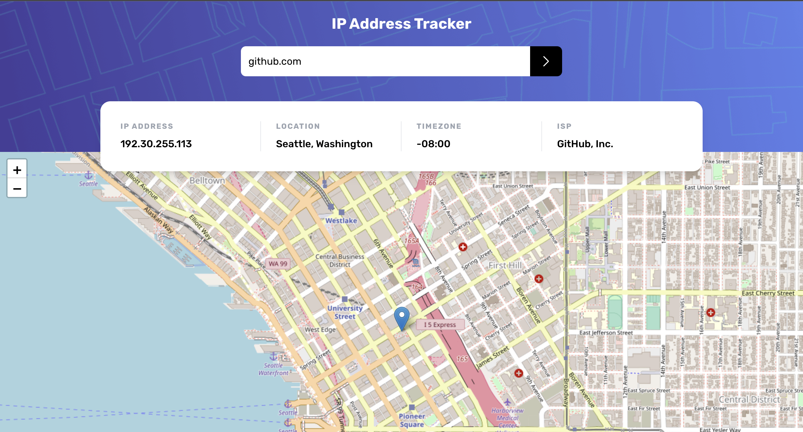

# Frontend Mentor - IP address tracker solution

This is a solution to the [IP address tracker challenge on Frontend Mentor](https://www.frontendmentor.io/challenges/ip-address-tracker-I8-0yYAH0). Frontend Mentor challenges help you improve your coding skills by building realistic projects.

## Table of contents

- [Overview](#overview)
  - [The challenge](#the-challenge)
  - [Screenshot](#screenshot)
  - [Links](#links)
  - [My process](#my-process)
  - [Built with](#built-with)
  - [What I learned](#what-i-learned)
- [Author](#author)

## Overview

### The challenge

Users should be able to:

- View the optimal layout for each page depending on their device's screen size
- See hover states for all interactive elements on the page
- See their own IP address on the map on the initial page load
- Search for any IP addresses or domains and see the key information and location

### Screenshot

### Links

- Solution Github URL: [Add solution URL here](https://github.com/mettad3v/ip-tracker)
- Live Site URL: [Add live site URL here](https://domainip-tracker.netlify.app/)

## My process

### Built with

- Vite
- [Vue](https://vuejs.org/) - JS library
- Typescript
- TailwindCSS
- Mobile-first workflow

### What I learned

Practiced the following

- Vue Events, Composition API
- Typescript with vue
- Learned more about watch, watchEffect

## Author

- Website - [Add your name here](https://www.milestonetech.netlify.app)
